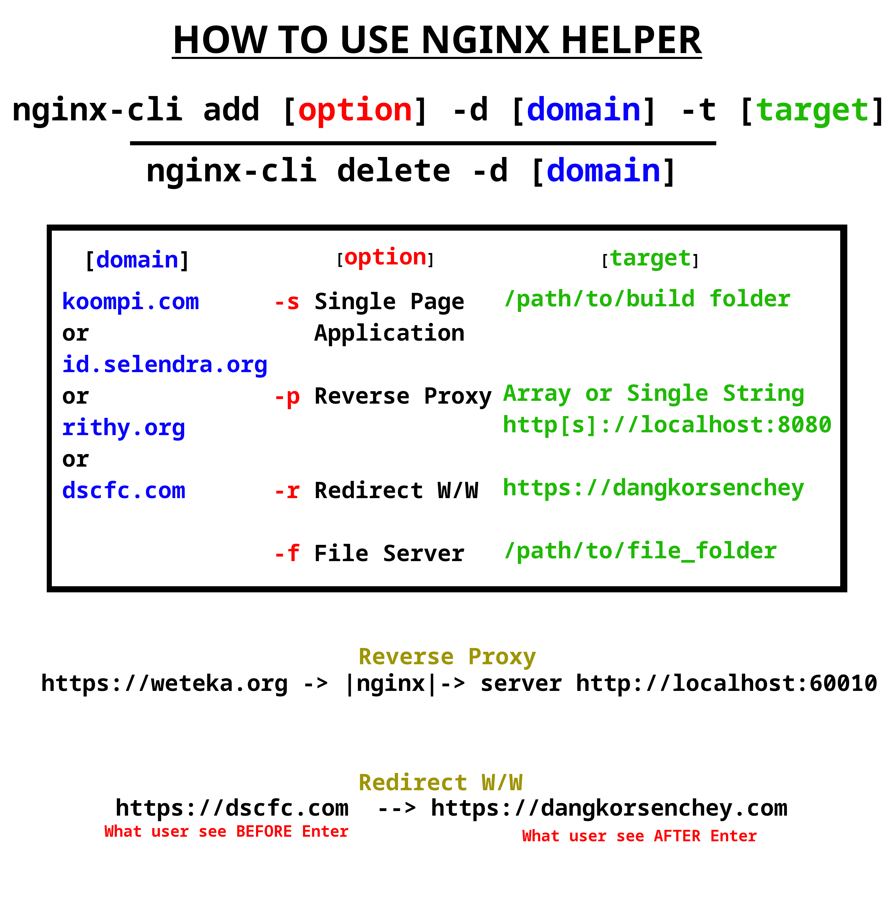

# NGINX-CLI

NGINX HELPER TOOLS is CLI tools to use libnginx-wrapper to create safe and easy nginx configuration with SSL HTTPS; NGINX HELP TOOLS needs sudo;



```
Nginx Helper Tools

Usage: nginx-cli <COMMAND>

Commands:
  add, -a, --add        Add new NGINX configuration file
  delete, -D, --delete  Delete NGINX configuration file
  list, -l, --list      list NGINX configuration file
  force, -F, --force    Force reConfigure NGINX or Certbot Program
  update, -u, --update  Update existing NGINX configuration file
  help                  Print this message or the help of the given subcommand(s)

Options:
  -h, --help     Print help
  -V, --version  Print version
```

## Detail Usage

<details close="close">
<summary><b>Add NGINX</b></summary>

Command:

```bash
sudo nginx-cli add -h
```

```
Add new NGINX configuration file

Usage: nginx-cli {add|--add|-a} --proxy --redir --filehost --spa --dname <domain_name> --target <target>...

Options:
  -p, --proxy                Proxy Feature: Add Reverse Proxy NGINX configuration file
  -r, --redir                Redirect Feature: Add Redirect NGINX configuration file
  -f, --filehost             FileHost Feature: Add File Hosting NGINX configuration file
  -s, --spa                  SPA Feature: Add Single Page App NGINX configuration file
  -d, --dname <domain_name>  Domain Name to receive ReverseProxy/Redirect/SPA/FileHost request from; eg: koompi.com
  -t, --target <target>...   Domain name to ReverseProxy/Redirect/SPA/FileHost to; eg: http://localhost:8080 or https://koompi.app or /kmp/filehost-spa
  -h, --help                 Print help
```

### Example Usage

How to add a Reverse Proxy From `www.koompi.com` to `http://localhost:7070`

Long:

```bash
sudo nginx-cli add --proxy --dname www.koompi.com --target http://localhost:7070
```

Short:

```bash
sudo nginx-cli -ap -d www.koompi.com -t http://localhost:7070
```

</details>

<details close="close">
<summary><b>Delete NGINX</b></summary>

Command:

```bash
sudo nginx-cli delete -h
```

```Delete NGINX configuration file

Usage: nginx-cli {delete|--delete|-D} --dname <domain_name>

Options:
  -d, --dname <domain_name>  Delete by Domain Name
  -h, --help                 Print help
```

### Example Usage

How to delete a `www.koompi.com` website

Long:

```bash
sudo nginx-cli delete --dname www.koompi.com
```

Short:

```bash
sudo nginx-cli -D -d www.koompi.com
```

</details>

<details close="close">
<summary><b>List NGINX</b></summary>

Command:

```bash
sudo nginx-cli list -h
```

```
list NGINX configuration file

Usage: nginx-cli {list|--list|-l} [OPTIONS] --proxy --redir --filehost --spa --all --one

Options:
  -p, --proxy                List NGINX Object of Proxy Feature
  -r, --redir                List NGINX Object of Redirect Feature
  -f, --filehost             List NGINX Object of FileHost Feature
  -s, --spa                  List NGINX Object of SPA Feature
  -a, --all                  List NGINX Object of All Feature
  -o, --one                  List one NGINX Object; need --dname argument
  -d, --dname <domain_name>  Domain Name to search ReverseProxy/Redirect/SPA/FileHost for; eg: koompi.com; use conjunction with --one argument
  -h, --help                 Print help
```

### Example Usage

How to list all nginx websites

Long:

```bash
sudo nginx-cli list --all
```

Short:

```bash
sudo nginx-cli -la
```

</details>

<details close="close">
<summary><b>Force NGINX</b></summary>

Command:

```bash
sudo nginx-cli force -h
```

```
Force reConfigure NGINX or Certbot Program

Usage: nginx-cli {force|--force|-F} [OPTIONS] --cert --migration

Options:
  -c, --cert                 Renew Certificate: Force Certbot renew certificate for domain name NGINX configuration file
  -d, --dname <domain_name>  Domain Name to force redo certificate
  -m, --migration            Database Migration: Force Repopulate DB with configuration file
  -h, --help                 Print help
```

### Example Usage

How to re-read all websites from system into DB in case of missing or mismatch in display

Long:

```bash
sudo nginx-cli list force --migration
```

Short:

```bash
sudo nginx-cli -Fm
```

</details>

<details close="close">
<summary><b>Update NGINX</b></summary>

Command:

```bash
sudo nginx-cli update -h
```

```
Update existing NGINX configuration file

Usage: nginx-cli {update|--update|-u} --dname <domain_name> --target <target>...

Options:
  -d, --dname <domain_name>  Domain Name to receive ReverseProxy/Redirect/SPA/FileHost request from; eg: koompi.com
  -t, --target <target>...   Domain name to ReverseProxy/Redirect/SPA/FileHost to; eg: http://localhost:8080 or https://koompi.app or /kmp/filehost-spa
  -h, --help                 Print help
```

### Example Usage

How to update and add new Proxy Server into already existing website

Long:

```bash
sudo nginx-cli update --dname www.weteka.org --target http://localhost:8080 http://localhost:2090 http://localhost:60010
```

Short:

```bash
sudo nginx-cli -u -d www.weteka.org -t http://localhost:8080 http://localhost:2090 http://localhost:60010
```

</details>